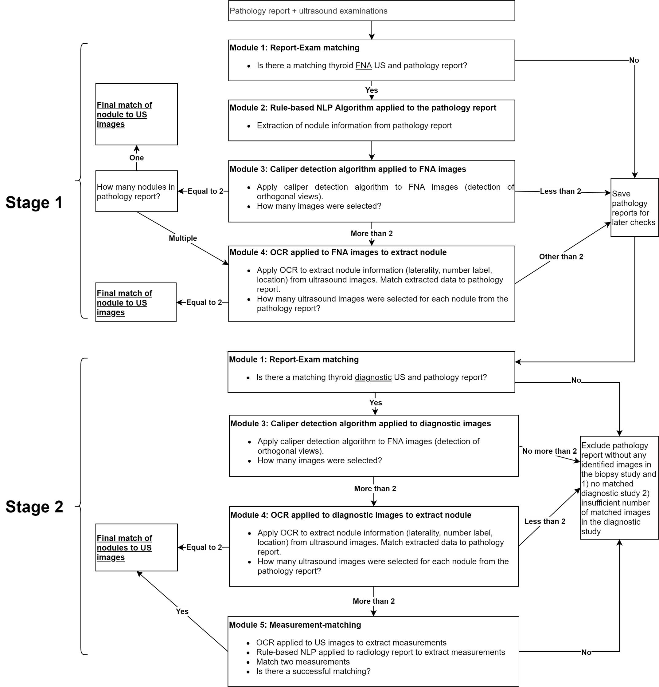

# MADLaP

Code repository for *Deep-Learning-based Multistep Automated Data Labelling Procedure (MADLaP) for Thyroid Nodules on Ultrasound: An Automated Image Annotation Tool*. MADLaP was a deep-learning-based tool to facilitate and automate the data annotation process for thyroid nodules. MADLaP takes multiple inputs (pathology report, US images, radiology report) and automatically identify two key US images of a specific thyroid nodule, and to correctly assign a pathology label. To achieve this goal, MADLaP utilized a combination of existing tools, including rule-based NLP models, a deep-learning-based imaging segmentation model, and an OCR tool. This repository contains scripts for image preprocessing (MatLab) and implementation (Python). 

Developed by [Jikai Zhang](https://github.com/JikaiZ/MADLaP).

Scripts for image preprocessing and M3, and pre-trained weights in M3 were modified used based on the project: [mateuszbuda](https://github.com/mateuszbuda/thyroid-us)

Shield: [![CC BY-NC-SA 4.0][cc-by-nc-sa-shield]][cc-by-nc-sa]

This work is licensed under a
[Creative Commons Attribution-NonCommercial-ShareAlike 4.0 International License][cc-by-nc-sa].

[![CC BY-NC-SA 4.0][cc-by-nc-sa-image]][cc-by-nc-sa]

[cc-by-nc-sa]: http://creativecommons.org/licenses/by-nc-sa/4.0/
[cc-by-nc-sa-image]: https://licensebuttons.net/l/by-nc-sa/4.0/88x31.png
[cc-by-nc-sa-shield]: https://img.shields.io/badge/License-CC%20BY--NC--SA%204.0-lightgrey.svg

## Usage

Be sure to prepare your own pathology/radiology report spreadsheet, a file that contains accession numbers, and ultrasound images.

### Preprocessing

Rescaling images.

Run `matlab -nodisplay -nosplash -nodesktop -r "run('file path');exit;"` 

This file path includes the path to `preprocessing.m`

### Implementation

The implementation scripts are listed below:
- `main_m.py`, `main_b.py` are main functions for running MADLaP, each of which extracts nodule info for malignant nodules and benign nodules respectively.
- `M1.py`, `M2.py`, `M3.py`, `M4.py`, `M5.py` contain module-specific functions. 
- `info_matching_1.py` contains functions used to produce yields in **M3, M4**, and pass candidate cases for **M5**.
- `info_matching_2.py` contains functions used to produce yields in **M5**.
- `utils.py` and `nlp_utils.py` contain some helper functions for various purposes.

Run `python main_m.py` for annotating malignant nodules. Likewise, run `python main_b.py` for annotating benign nodules.

### Trained weights in M3

Please contact me to get trained weights. 

## Results

We developed MADLaP on a training set of 378 patients and tested it on a separate set of 93 patients. MADLaP achieved a yield rate of 62% and an accuracy of 86% on the test set. 

